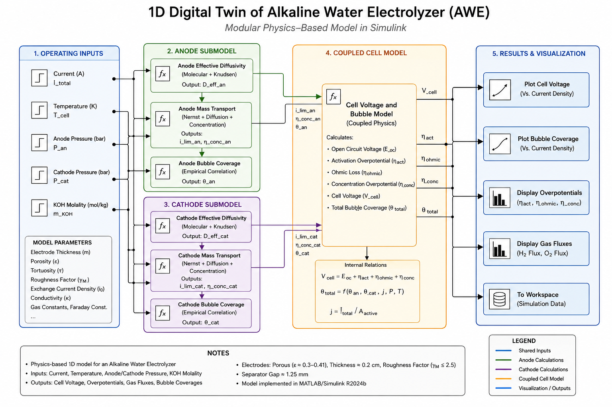
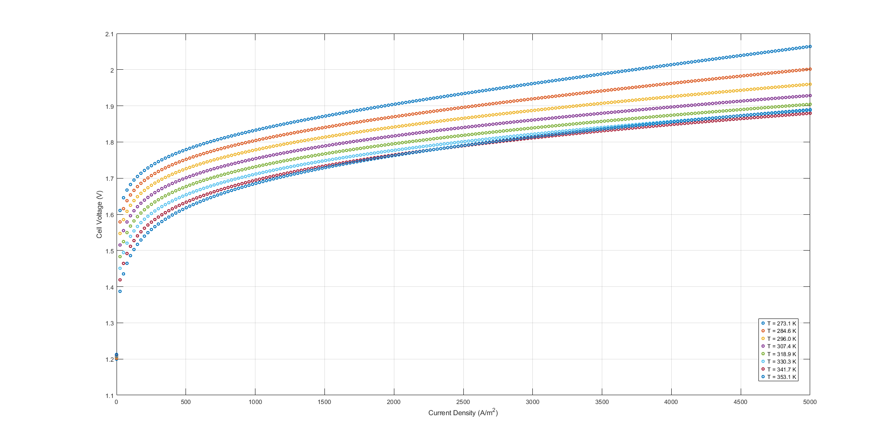
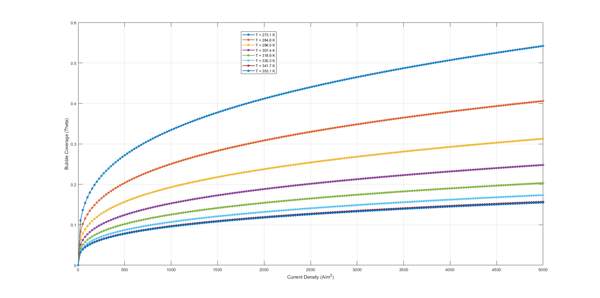

# 1D Digital Twin of an Alkaline Water Electrolyzer

A physics-based MATLAB/Simulink digital twin for exploring the
electrochemical, transport, ohmic, and gas-bubble behaviour of an alkaline
water electrolysis cell.

The repository combines a working Simulink model, model-generated datasets,
static and interactive Plotly visualisations, and a Streamlit dashboard for
operating-point exploration.

> The project was developed under CATALYST, the Official Process Design Club
> of NIT Tiruchirappalli.



## Project objectives

The project aims to:

- Model cell-voltage response across current, temperature, and pressure
- Represent activation, ohmic, and concentration losses
- Study gas-bubble surface coverage and its effect on electrolysis behaviour
- Export simulation results into reusable tabular datasets
- Provide interactive engineering visualisations for technical and
  non-specialist users
- Demonstrate how digital twins can support green-hydrogen process analysis

## Core capabilities

- One-dimensional electrochemical cell model in MATLAB/Simulink
- Modular anode, cathode, and coupled voltage calculations
- Temperature, pressure, and current sensitivity analysis
- Bubble-coverage and hydrogen-flux outputs
- Two model-generated parameter-sweep datasets
- Four self-contained interactive Plotly surfaces
- Streamlit dashboard with operating-point history and animated transitions
- Windows-safe MATLAB cache and code-generation configuration

## Repository structure

```text
alkaline-water-electrolyzer-digital-twin/
├── README.md
├── UPLOAD_ORDER.md
├── CONTRIBUTING.md
├── requirements.txt
├── .python-version
├── .gitignore
├── streamlit_app.py
├── setup_windows.bat
├── run_app.bat
├── run_app.sh
│
├── .streamlit/
│   └── config.toml
│
├── model/
│   ├── awe_dt.slx
│   └── README.md
│
├── matlab/
│   └── setup_awe_build.m
│
├── data/
│   ├── awe_current_temperature_1bar.csv
│   ├── awe_pressure_temperature_90a.csv
│   └── README.md
│
└── docs/
    ├── index.html
    ├── .nojekyll
    ├── validation.md
    ├── architecture/
    │   └── awe_model_architecture.png
    ├── figures/
    │   ├── cell_voltage_vs_current_density_temperature.png
    │   └── bubble_coverage_vs_current_density_temperature.png
    ├── interactive/
    │   ├── cell_voltage_pressure_temperature_90a.html
    │   ├── bubble_coverage_pressure_temperature_90a.html
    │   ├── cell_voltage_current_temperature_1bar.html
    │   └── bubble_coverage_current_temperature_1bar.html
    └── presentation/
        └── README.md
```

## Model architecture

The digital twin is organised into five conceptual stages:

1. **Operating inputs:** current, temperature, anode pressure, cathode
   pressure, electrolyte molality, and model parameters
2. **Anode submodel:** effective diffusivity, mass transport, concentration
   effects, and anode bubble coverage
3. **Cathode submodel:** effective diffusivity, mass transport, concentration
   effects, and cathode bubble coverage
4. **Coupled cell model:** open-circuit voltage, activation loss, ohmic loss,
   concentration loss, cell voltage, gas fluxes, and total bubble coverage
5. **Results layer:** figures, exported data, interactive HTML surfaces, and
   the Streamlit application

## Model and software requirements

### Simulink model

- MATLAB/Simulink: **R2024b Update 5**
- Operating system used to save the model: Windows 64-bit
- Recommended Windows working path:
  `C:\AWE\alkaline-water-electrolyzer-digital-twin`

### Python application

- Python: **3.12 recommended**
- Streamlit: **1.60.0**
- pandas: **3.0.3**
- Plotly: **6.9.0**
- NumPy: **2.5.1**

## Datasets

### Current and temperature sweep

File: `data/awe_current_temperature_1bar.csv`

- Rows: **2,450**
- Temperature points: **50**
- Current points: **49**
- Temperature range: **273 to 373 K**
- Current range: **3.061 to 150.000 A**
- Outputs: cell voltage, bubble coverage, and hydrogen flux

### Pressure and temperature sweep at 90 A

File: `data/awe_pressure_temperature_90a.csv`

- Rows: **2,900**
- Temperature points: **50**
- Pressure points: **58**
- Temperature range: **273 to 373 K**
- Pressure range: **1.017 to 30.000 bar**
- Outputs: cell voltage and bubble coverage

Detailed column descriptions are available in
[`data/README.md`](data/README.md).

## Static results

### Cell voltage versus current density and temperature



### Bubble coverage versus current density and temperature



## Interactive Results

[Open the Interactive Results Homepage](https://jnanadyuti-patra.github.io/alkaline-water-electrolyzer-digital-twin/)

- [Cell Voltage vs Pressure and Temperature at 90 A](https://jnanadyuti-patra.github.io/alkaline-water-electrolyzer-digital-twin/interactive/cell_voltage_pressure_temperature_90a.html)
- [Bubble Coverage vs Pressure and Temperature at 90 A](https://jnanadyuti-patra.github.io/alkaline-water-electrolyzer-digital-twin/interactive/bubble_coverage_pressure_temperature_90a.html)
- [Cell Voltage vs Current and Temperature at Approximately 1 Bar](https://jnanadyuti-patra.github.io/alkaline-water-electrolyzer-digital-twin/interactive/cell_voltage_current_temperature_1bar.html)
- [Bubble Coverage vs Current and Temperature at Approximately 1 Bar](https://jnanadyuti-patra.github.io/alkaline-water-electrolyzer-digital-twin/interactive/bubble_coverage_current_temperature_1bar.html)

Each file is self-contained and can be viewed without running Python.

## Installation and local use

### 1. Download or clone the repository

```bash
git clone https://github.com/YOUR-USERNAME/alkaline-water-electrolyzer-digital-twin.git
cd alkaline-water-electrolyzer-digital-twin
```

For MATLAB use on Windows, place the repository in a short path such as:

```text
C:\AWE\alkaline-water-electrolyzer-digital-twin
```

Avoid running from a ZIP preview, OneDrive-synchronised deep path, or temporary
download folder.

### 2. Run the Streamlit application on Windows

#### Automated setup

Double-click:

```text
setup_windows.bat
```

After installation completes, double-click:

```text
run_app.bat
```

The app should open at:

```text
http://localhost:8501
```

#### Manual Windows setup

```bat
py -3.12 -m venv .venv
.venv\Scripts\activate
python -m pip install --upgrade pip
python -m pip install -r requirements.txt
python -m streamlit run streamlit_app.py
```

### 3. Run the Streamlit application on macOS or Linux

```bash
python3 -m venv .venv
source .venv/bin/activate
python -m pip install --upgrade pip
python -m pip install -r requirements.txt
python -m streamlit run streamlit_app.py
```

Alternatively:

```bash
chmod +x run_app.sh
./run_app.sh
```

Stop the server with `Ctrl+C`.

## Running the Simulink model

### Windows-safe setup

1. Copy or clone the repository to:

   ```text
   C:\AWE\alkaline-water-electrolyzer-digital-twin
   ```

2. Open MATLAB R2024b.

3. Set the MATLAB Current Folder to the repository root.

4. Run:

   ```matlab
   addpath('matlab')
   setup_awe_build
   ```

5. In Simulink, press `Ctrl+D` to update the diagram.

6. Simulate a known baseline case before changing parameters.

The setup script directs Simulink cache and code-generation output to short
folders inside `build/`, reducing the risk of Windows path-length errors.

## Streamlit application modes

The dashboard contains three modes:

1. **Current and temperature sweep at approximately 1 bar**
2. **Pressure and temperature sweep at 90 A**
3. **Synthetic temperature, pressure, and current demonstration**

The third mode is clearly labelled synthetic. It is included to demonstrate
the interface and is not exported from the validated Simulink datasets.

Streamlit App Link: (https://alkaline-water-electrolyzer-1d-digital-twin.streamlit.app)

## Validation and limitations

The project presentation reports comparison with HRI and PHOEBUS
polarisation data over approximately **35 to 80 degrees Celsius** and
**1 to 9 bar**.

The exported datasets cover a broader domain, reaching **273 to 373 K** and
approximately **1 to 30 bar**. Outputs outside the reported comparison domain
should therefore be treated as exploratory model extrapolations.

Read [`docs/validation.md`](docs/validation.md) before using the results.

## Credits

Developed under **CATALYST, the Official Process Design Club of NIT
Tiruchirappalli**.

Repository maintainer:

**Jnanadyuti Patra**

- GitHub: `Jnanadyuti-Patra`
- LinkedIn: `jnanadyutipatra`

Add the verified full names and GitHub handles of all project contributors
before public release.

## Licence

No open-source licence has been assigned in this package. Until the project
team selects a licence, normal copyright restrictions apply. Do not reuse,
redistribute, or commercialise the model without permission from the project
team.
